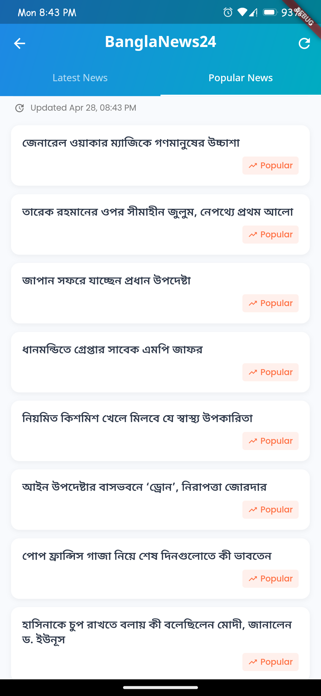

<h1 align="center">📰 Web Scraping News App</h1>

  

    
    
  

A modern web scraping application that fetches real-time Gold/Silver prices and news from multiple trusted websites, beautifully organized into a clean UI.

---

## 🌟 Features

- **Real-time scraping** from multiple trusted sources
- **Gold/Silver prices** from Bajus (Bangladesh Jewellers' Association)
- **News aggregation** from top Bangladeshi newspapers:
    - Prothom Alo
    - Kaler Kontho
    - Banglanews24
- **Lightweight** and easy to set up.
- **Customizable** there's still more I plan to add.

---

## 📷 Screenshots

<table align="center">
  <tr>
    <td align="center">
       
      Home Screen
    </td>
    <td align="center">
       
      Gold Prices
    </td>
    <td align="center">
       
      News List
    </td>
    <td align="center">
       
      News List
    </td>
  </tr>
</table>

