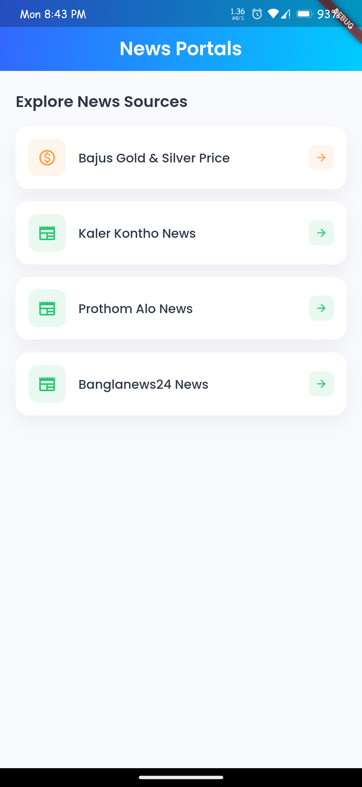
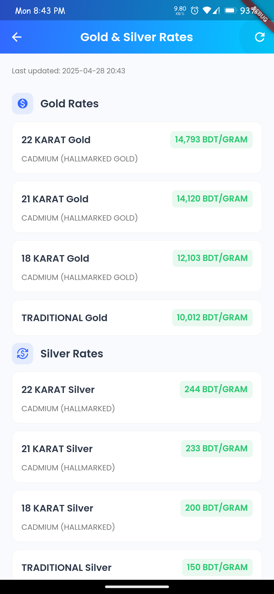
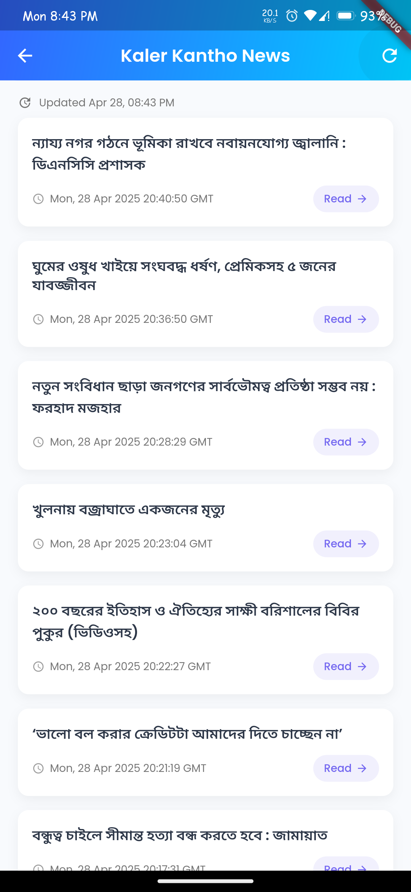
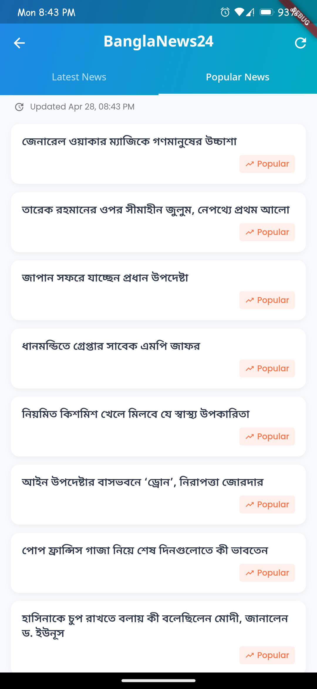

<h1 align="center">📰 BD News Hub</h1>

<p align="center">
  
  
  
  
</p>

<p align="center">  
A modern Flutter news aggregation app that fetches real-time news from <strong>18 Bangladeshi portals</strong> 
(14 বাংলা + 3 English + 1 finance), featuring offline caching, cross-portal search, and dark mode.
</p>

---

## ✨ Features

| Feature | Description |
|---------|-------------|
| 🗞️ **Multi-Portal News** | Aggregates from 18 Bangladeshi portals (14 বাংলা + 3 English + 1 finance) |
| 🔍 **Cross-Portal Search** | Search across all portals simultaneously with live progress |
| 💾 **Offline Caching** | Hive-based 30-min cache — works offline with stale data |
| 🌙 **Dark Mode** | Full light/dark theme with system-aware defaults |
| 📊 **Category Filtering** | Filter portals by বাংলা / English / Finance |
| 🔄 **Pull-to-Refresh** | All screens support refresh with cooldown protection |
| 📤 **Share Articles** | Share article links via native share sheet |
| 🥧 **Shimmer Loading** | Skeleton loading placeholders for better perceived performance |
| 🏗️ **4 Scraping Strategies** | REST API, RSS, HTML DOM, and Sitemap XML parsing |

---

## 🏗️ Architecture

```
lib/
├── main.dart                          # Entry point (Riverpod ProviderScope + Hive init)
├── homepage.dart                      # Portal hub with category chips + search
│
├── core/
│   ├── config/
│   │   ├── constants.dart             # App-wide constants (timeouts, pagination, cache TTL)
│   │   └── portals.dart               # Centralized portal registry (URLs, colors, selectors)
│   │
│   ├── models/
│   │   └── news_item.dart             # Immutable article data class with copyWith
│   │
│   ├── services/
│   │   ├── cache_service.dart          # Hive offline caching layer
│   │   └── news_scraper.dart          # Centralized scraper (HTML/RSS/API/Sitemap)
│   │
│   ├── theme/
│   │   └── app_theme.dart             # Light + dark Material 3 themes (Poppins font)
│   │
│   ├── utils/
│   │   ├── app_http_client.dart       # HTTP client factory (bad-cert bypass)
│   │   ├── external_link_opener.dart  # URL normalization + url_launcher
│   │   └── text_utils.dart            # cleanText() + formatTimestamp()
│   │
│   └── widgets/
│       ├── news_list_tile.dart        # Unified news card (share, popular badge, images)
│       ├── shimmer_loader.dart        # Animated skeleton loading
│       ├── portal_app_bar.dart        # Gradient AppBar with curved bottom
│       └── error_state_widget.dart    # Error UI with retry button
│
└── features/
    ├── providers/
    │   └── news_providers.dart        # Riverpod state management (news, search, theme)
    │
    ├── pages/                         # 10 portal screens (refactored to shared widgets)
    │   ├── bajus_prices_screen.dart
    │   ├── prothomalo_news_screen.dart
    │   ├── kalerkontho_news_screen.dart
    │   ├── banglanews24_news_screen.dart
    │   ├── ittefaq_news_screen.dart
    │   ├── business_standard_news_screen.dart
    │   ├── daily_star_news_screen.dart
    │   ├── jugantor_news_screen.dart
    │   ├── samakal_news_screen.dart
    │   └── manabzamin_news_screen.dart
    │
    └── search_screen.dart             # Cross-portal search UI
```

### Design Decisions

- **Riverpod** for state management — auto-dispose, caching, testable providers
- **Hive** for offline storage — lightweight NoSQL, no code generation needed
- **Centralized config** — all URLs, CSS selectors, and portal metadata in one place
- **Shared widgets** — single `NewsListTile` eliminates ~400 lines of duplication
- **Strategy pattern** — each portal declares its scraping strategy (HTML/RSS/API/Sitemap)

---

## 📦 Tech Stack

| Category | Packages |
|----------|----------|
| **Framework** | Flutter 3.27+, Dart 3.5+ |
| **State Management** | `flutter_riverpod` 2.6 |
| **HTTP & Parsing** | `http` 1.2, `html` 0.15 |
| **Local Storage** | `hive` 2.2, `hive_flutter` 1.1 |
| **UI** | `google_fonts`, `cached_network_image` |
| **Utilities** | `intl`, `url_launcher`, `share_plus`, `collection` |
| **Testing** | `flutter_test` (61 tests) |

---

## 🚀 Getting Started

### Prerequisites
- Flutter SDK `>=3.5.0`
- Dart SDK `>=3.5.0`

### Setup
```bash
# Clone the repository
git clone https://github.com/your-username/bd-news-hub.git
cd bd-news-hub

# Install dependencies
flutter pub get

# Run the app
flutter run
```

### Build
```bash
# Android APK
flutter build apk --release

# Android App Bundle
flutter build appbundle --release

# iOS
flutter build ios --release
```

---

## 🧪 Testing

```bash
# Run all tests
flutter test

# Run with coverage
flutter test --coverage

# Run specific test file
flutter test test/utils/text_utils_test.dart
```

### Test Coverage

| Category | Tests | Description |
|----------|-------|-------------|
| **Unit Tests** | 37 | TextUtils, URL normalization, NewsItem model, PortalConfig |
| **Widget Tests** | 24 | NewsListTile, ErrorStateWidget, HomePage filtering |
| **Total** | **61** | **All passing ✅** |

---

## 📱 Supported Portals

| Portal | Language | Strategy |
|--------|----------|----------|
| **Bajus** | English | HTML DOM Scraping |
| **Prothom Alo** | বাংলা | REST API (JSON) |
| **Kaler Kantho** | বাংলা | RSS Feed |
| **BanglaNews24** | বাংলা | HTML DOM Scraping |
| **Ittefaq** | বাংলা | HTML DOM Scraping |
| **TBS News** | বাংলা | HTML DOM Scraping (with images) |
| **Jugantor** | বাংলা | Google News Sitemap |
| **Samakal** | বাংলা | HTML DOM Scraping |
| **Manabzamin** | বাংলা | HTML DOM Scraping |
| **bdnews24** | বাংলা | HTML DOM Scraping |
| **Jago News 24** | বাংলা | HTML DOM Scraping |
| **Somoy News** | বাংলা | HTML DOM Scraping |
| **Bangla Tribune** | বাংলা | HTML DOM Scraping |
| **Dhaka Post** | বাংলা | HTML DOM Scraping |
| **Daily Inqilab** | বাংলা | HTML DOM Scraping |
| **The Daily Star** | English | HTML DOM Scraping |
| **Dhaka Tribune** | English | HTML DOM Scraping |
| **New Age** | English | HTML DOM Scraping |
| **The Financial Express** | English | HTML DOM Scraping |

---

## 🔑 Key Highlights

### 1. Centralized Portal Config
All portal metadata (URLs, colors, CSS selectors) live in a single `portals.dart` file. Adding a new portal is as simple as adding one `PortalConfig` entry.

### 2. Strategy Pattern for Scraping
Each portal declares its `ScrapingStrategy` (HTML/RSS/API/Sitemap). The `NewsScraperService` routes to the correct parser automatically.

### 3. Offline-First Caching
Hive caches articles for 30 minutes. On launch, users see cached data instantly while fresh data loads in the background.

### 4. Cross-Portal Search
A single search bar queries all 18 portals in parallel, showing results grouped by source with live progress indicators.

### 5. Refresh Cooldown
A 5-second cooldown prevents users from spamming refresh and getting IP-banned by news sites.

---

## 📸 Screenshots

<table>
  <tr>
    <td align="center"><br/><sub>Home Screen</sub></td>
    <td align="center"><br/><sub>Gold/Silver Prices</sub></td>
    <td align="center"><br/><sub>News List</sub></td>
    <td align="center"><br/><sub>Dark Mode</sub></td>
  </tr>
</table>

---

## 🗺️ Roadmap

- [ ] Push notifications for breaking news
- [ ] Bookmark/favorite articles
- [ ] Infinite scroll / pagination
- [ ] Portal-specific search
- [ ] Share article as image card
- [ ] Web support

---

## 📄 License

This project is licensed under the MIT License. See `LICENSE` for details.

---

## 🤝 Contributing

Contributions are welcome! Please open an issue or submit a PR.

---

<p align="center">Made with ❤️ using Flutter</p>
